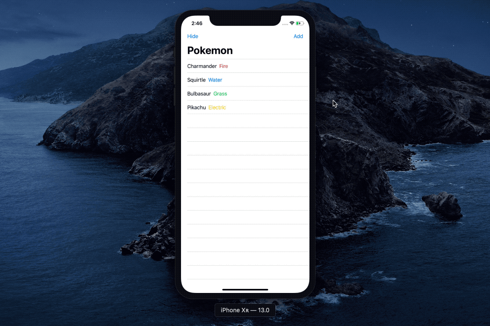

# Understanding Binding 
### Tutorials to learn to build this project
*We will create a Button that hide and shows the
type of each Pokemon. We then refactor that Button
into its own View and use Bindable to change the state
of the parent View ✨*

📖 **Article: [Understanding Binding](https://medium.com/@martinlasek/swiftui-understanding-binding-8e20269a76bc)**
 
🎥 **Video: [Understanding Binding](https://youtu.be/ZrTHzu3Hkio)**

